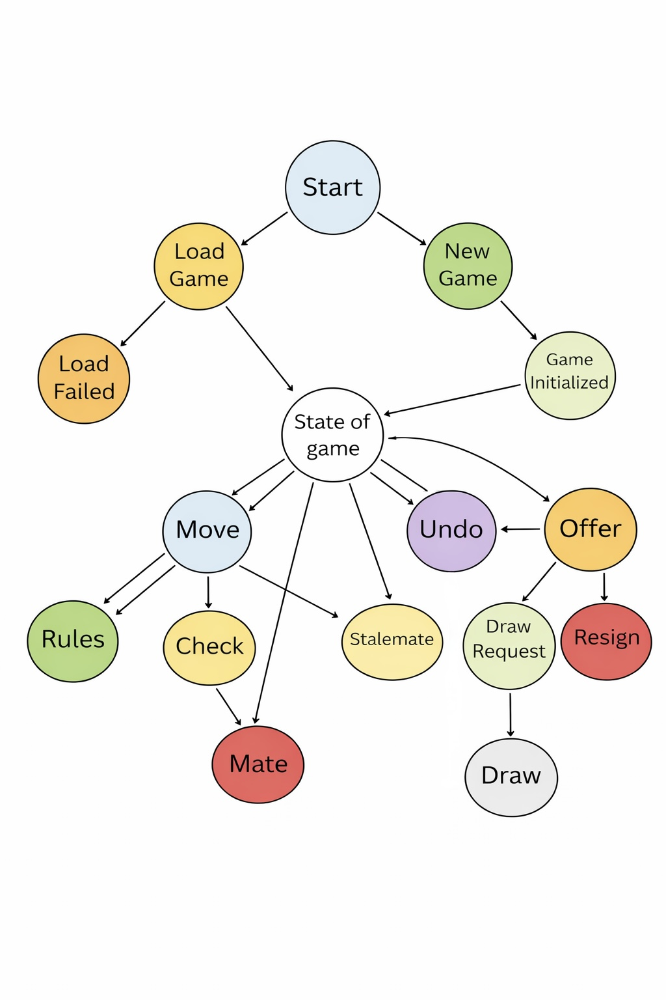

# AFK2 Console Chess (C++)

A fully-featured, object-oriented chess engine implementation in C++17. This project provides a complete chess game with move validation, game state management, PGN support, and comprehensive test coverage. Perfect for learning chess game development, engine architecture, and C++ best practices.

## Table of Contents

- [About the Game](#about-the-game)
- [Features](#features)
- [Game State Diagram](#game-state-diagram)
- [How to Play](#how-to-play)
- [Getting Started](#getting-started)
  - [Requirements](#requirements)
  - [Installation](#installation)
  - [Quick Start](#quick-start)
- [Usage](#usage)
- [Architecture](#architecture)
- [Project Structure](#project-structure)
- [Development](#development)
- [Known Limitations](#known-limitations)
- [Contributing](#contributing)
- [License](#license)

## About the Game

AFK2 Console Chess is a standards-compliant chess implementation that follows the official rules of chess. It provides:

- **Complete piece movement rules** for all six piece types (Pawn, Knight, Bishop, Rook, Queen, King)
- **Full move validation** including illegal move detection and king safety checks
- **Special moves support** including castling, en passant, and pawn promotion
- **Game clock system** with configurable time controls (default 5 minutes per player)
- **PGN support** for saving and loading games in portable game notation format
- **Move history tracking** for undo/redo functionality and game replay

The game runs in the console with a clean, modular architecture that separates concerns between game logic, rules validation, and I/O handling.

## Features

### Core Gameplay
- ✓ Standard chess rules for all piece movements
- ✓ Legal move validation with king safety checks
- ✓ Special moves: castling, en passant, pawn promotion
- ✓ Check and checkmate detection
- ✓ Stalemate detection
- ✓ Move notation support (algebraic and coordinate notation)
- ✓ Game state tracking and turn management

### Game Management
- ✓ **PGN Support**: Save and load games in Portable Game Notation format
- ✓ **Move History**: Track all moves played during a game
- ✓ **Chess Clock**: Per-player time management with configurable limits
- ✓ **Draw Offers**: In-game draw negotiation between players
- ✓ **Game Replay**: Reconstruct game state from PGN files

### Code Quality
- ✓ Clean object-oriented design following SOLID principles
- ✓ Comprehensive unit test suite using Google Test
- ✓ Modular architecture separating game logic from validation and I/O
- ✓ Modern C++17 features (move semantics, smart pointers, etc.)
- ✓ Extensive inline documentation and sanity checks

## Game State Diagram

The following diagram shows the flow of game states and transitions:



This diagram illustrates how the game transitions between different states (ongoing, check, checkmate, stalemate, draw) and the conditions that trigger each transition.

## How to Play

### Basic Rules

1. **Starting Position**: The game begins with pieces in standard starting positions
2. **Turn-based Movement**: Players alternate moving one piece per turn (White starts first)
3. **Movement Rules**: Each piece has specific movement patterns:
   - **Pawn**: Moves forward one square (two on first move), captures diagonally
   - **Knight**: Moves in L-shape (2 squares one direction, 1 perpendicular)
   - **Bishop**: Moves diagonally any number of squares
   - **Rook**: Moves horizontally or vertically any number of squares
   - **Queen**: Combines rook and bishop movement
   - **King**: Moves one square in any direction

4. **Check**: Your king is under attack and must escape
5. **Checkmate**: Your king is in check and cannot escape - you lose
6. **Stalemate**: Your king is not in check but you have no legal moves - results in draw
7. **Draw**: Can occur by agreement, stalemate, three-fold repetition, or 50-move rule

### Special Moves

- **Castling**: King and rook move simultaneously if conditions are met (never moved before, no pieces between, not in check)
- **En Passant**: Pawn can capture an opponent's pawn that just moved two squares forward
- **Promotion**: Pawn automatically promotes to queen, rook, bishop, or knight upon reaching the back rank

### Time Control

Each player has 5 minutes on their clock by default. The clock counts down during your turn and resets when you complete a move.

## Getting Started

### Requirements

- **Compiler**: C++17 compatible compiler
  - `clang++` 5.0+ (recommended)
  - `g++` 7.0+
- **Build System**: GNU `make`
- **Testing** (optional): Google Test framework for running unit tests
- **OS**: macOS, Linux, or Windows (with MSYS2/MinGW)

### Installation

1. **Clone the repository**
   ```bash
   git clone <repo-url> AFK2-Console-Chess-CPP
   cd AFK2-Console-Chess-CPP
   ```

2. **Verify requirements**
   ```bash
   clang++ --version    # Should be 5.0 or higher
   make --version       # Should be GNU Make 3.8 or higher
   ```

3. **Build the project**
   ```bash
   make build
   ```

### Quick Start

Get the game running immediately:

```bash
# Build and run the game
make run

# Run unit tests (if GoogleTest is installed)
make test

# Clean build artifacts
make clean
```

The `make run` command will:
1. Compile the chess engine
2. Execute sanity checks on all game components
3. Run a PGN round-trip demonstration
4. Generate a sample game file (`sample_game.pgn`)

## Usage

### Command Line Interface

The game accepts the following make commands:

| Command | Description |
|---------|-------------|
| `make build` | Compile the chess program |
| `make run` | Build and run the chess program with demo |
| `make test` | Build and run the unit test suite |
| `make clean` | Remove all build artifacts |
| `make rebuild` | Clean and build from scratch |
| `make debug` | Build with debugging symbols and no optimization |
| `make help` | Display help information |

### Example: Build and Run

```bash
# Clean build and run
make rebuild run

# Run tests with debugging symbols
make debug test

# Build only, without running
make build
```

The compiled executable is located at: `build/bin/chess`

### Game State and Output

When you run `make run`, the program:
- Initializes the chess board with the standard starting position
- Validates all piece movements and game rules
- Runs internal sanity checks to verify correctness
- Executes a complete PGN save/load test cycle
- Outputs sample game notation to `sample_game.pgn`

## Architecture

### Design Principles

The project follows these architectural principles:

1. **Single Source of Truth**: The `Board` class maintains all game state
2. **Separation of Concerns**: Game logic, validation, and I/O are cleanly separated
3. **Object-Oriented Design**: Each piece type has its own class with consistent interfaces
4. **Immutability for Safety**: Board state is copied for move validation to prevent side effects
5. **Composition over Inheritance**: Game logic composes various validators and utilities

### Core Components

- **Board**: Central game state, holds piece positions and metadata
- **Piece Hierarchy**: Base `Piece` class with derived classes for each piece type
- **Move Validator**: Checks move legality and ensures king safety
- **Game State Manager**: Orchestrates game flow and turn management
- **PGN Handler**: Serializes/deserializes games to standard notation
- **Chess Clock**: Manages time per player

## Project Structure

```
src/
├── main.cpp                    # Entry point and demo harness
├── game.cpp                    # Game logic and orchestration
└── chess/
    ├── core/                   # Core game components
    │   ├── Board.{hpp,cpp}        # Main game board
    │   ├── Game.{hpp,cpp}         # Game state and flow
    │   ├── Move.{hpp,cpp}         # Move representation
    │   ├── Piece.{hpp,cpp}        # Base piece class
    │   ├── Player.{hpp,cpp}       # Player management
    │   ├── ChessClock.{hpp,cpp}   # Time management
    │   ├── Position.{hpp,cpp}     # Board position utilities
    │   ├── Color.hpp              # Piece color enumeration
    │   └── GameState.hpp          # Game state constants
    │
    ├── pieces/                 # Piece implementations
    │   ├── Pawn.{hpp,cpp}
    │   ├── Knight.{hpp,cpp}
    │   ├── Bishop.{hpp,cpp}
    │   ├── Rook.{hpp,cpp}
    │   ├── Queen.{hpp,cpp}
    │   └── King.{hpp,cpp}
    │
    ├── rules/                  # Game rule enforcement
    │   ├── MoveValidator.{hpp,cpp}
    │   ├── CastlingHandler.{hpp,cpp}
    │   ├── EnPassantHandler.{hpp,cpp}
    │   ├── PromotionHandler.{hpp,cpp}
    │   └── UndoManager.{hpp,cpp}
    │
    ├── pgn/                    # PGN file support
    │   ├── PgnIO.{hpp,cpp}
    │   ├── PgnParser.{hpp,cpp}
    │   └── PgnWriter.{hpp,cpp}
    │
    ├── io/                     # Input/output handling
    │   ├── ConsoleUI.{hpp,cpp}
    │   ├── CommandHandler.{hpp,cpp}
    │   ├── InputParser.{hpp,cpp}
    │   └── CommandType.hpp
    │
    ├── engine/                 # Game engine
    │   ├── ChessEngine.hpp
    │   └── GameController.{hpp,cpp}
    │
    └── util/                   # Utility functions
        └── AlgebraicNotationUtil.{hpp,cpp}

tests/
├── unit/
│   ├── core/                   # Core component tests
│   ├── pieces/                 # Piece behavior tests
│   ├── rules/                  # Rule enforcement tests
│   └── engine/                 # Engine behavior tests
└── [test files]
```

## Development

### Building for Development

```bash
# Build with debug symbols (no optimization)
make debug

# Run unit tests
make test

# Watch for file changes and rebuild (requires entr)
make rebuild run
```

### Key Classes and Their Responsibilities

| Class | Purpose |
|-------|---------|
| `Board` | Manages piece positions and queries legal moves |
| `Game` | Orchestrates game flow, turns, and clock management |
| `MoveValidator` | Validates move legality and king safety |
| `PgnIO` | Handles game serialization to/from PGN format |
| `ChessClock` | Manages per-player time tracking |
| `Piece` (and subclasses) | Represent pieces and calculate their movement possibilities |

### Running Tests

```bash
# Run all unit tests
make test

# Run tests with verbose output
make test VERBOSE=1

# Rebuild and run tests
make clean test
```

Tests use the Google Test framework and cover:
- Core piece movement rules
- Move validation and king safety
- Special moves (castling, en passant, promotion)
- Board state management
- PGN parsing and generation

## Known Limitations

- **Console-based UI only**: No graphical interface (can be added as extension)
- **No AI/Engine**: This is a rule-enforcing system, not a playing engine
- **Limited PGN features**: Basic SAN notation; some advanced PGN tags not fully supported
- **No networking**: Single-machine games only
- **No game replay interface**: Games can be saved/loaded but not replayed interactively

These limitations can be addressed in future versions without changes to the core architecture.

## Contributing

Contributions are welcome! When contributing, please:

1. **Maintain code style**: Follow existing naming conventions and formatting
2. **Keep separation of concerns**: Don't mix game logic with I/O or validation
3. **Add tests**: Include unit tests for new features
4. **Update documentation**: Keep README and code comments current
5. **Test thoroughly**: Run `make test` before submitting changes

Areas for contribution:
- Enhanced PGN support with more notation variants
- Console UI improvements
- Additional test cases
- Performance optimizations
- Documentation improvements

## License

This project is licensed under the terms specified in the [LICENSE](LICENSE) file.
- Document new command-line or PGN behaviors in this README.

## License
See `LICENSE` in the project root.
